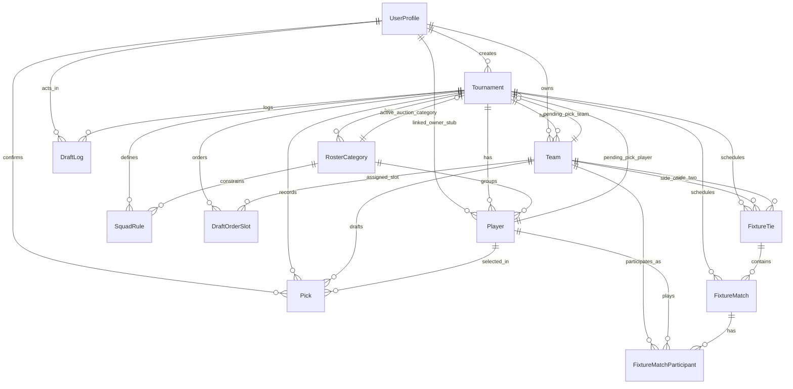

# Database Documentation

## Overview
The platform uses PostgreSQL with Prisma ORM. Multi-tenant tournament data is centered around `Tournament`, with related entities for teams, players, draft flow, and fixtures.

## Core Design
- `UserProfile` stores user identity, role, and ownership/admin relationships.
- `Tournament` is the aggregate root for setup, draft state, and fixtures.
- `Team`, `Player`, `RosterCategory`, and `SquadRule` model tournament setup constraints.
- `DraftOrderSlot`, `Pick`, and `DraftLog` model the draft lifecycle.
- `FixtureTie`, `FixtureMatch`, and `FixtureMatchParticipant` model tournament run fixtures/results.
- Soft delete is implemented where required via `deletedAt` (`UserProfile`, `Tournament`, `Team`, `Player`).

## Entity Relationship Diagram

## Key Integrity Rules
- `Tournament.slug` is globally unique.
- A player can be linked to at most one owner per tournament via `@@unique([tournamentId, linkedOwnerUserId])`.
- Each draft slot index is unique per tournament via `@@unique([tournamentId, slotIndex])`.
- A player can be picked at most once per tournament via `@@unique([tournamentId, playerId])`.
- Squad limits are unique per tournament/category via `@@unique([tournamentId, rosterCategoryId])`.

## Enum Domains
- User/access: `UserRole`
- Player metadata: `Gender`
- Draft state: `DraftPhase`, `PickStatus`, `DraftLogAction`
- Tournament mode: `TournamentFormat`
- Fixtures: `FixtureMatchType`, `FixtureStatus`, `FixtureSide`

## Audit and Timestamps
- All transactional entities include `createdAt` and/or `updatedAt`.
- Draft actions are audit-trailed in `DraftLog` with optional actor and payload metadata.
